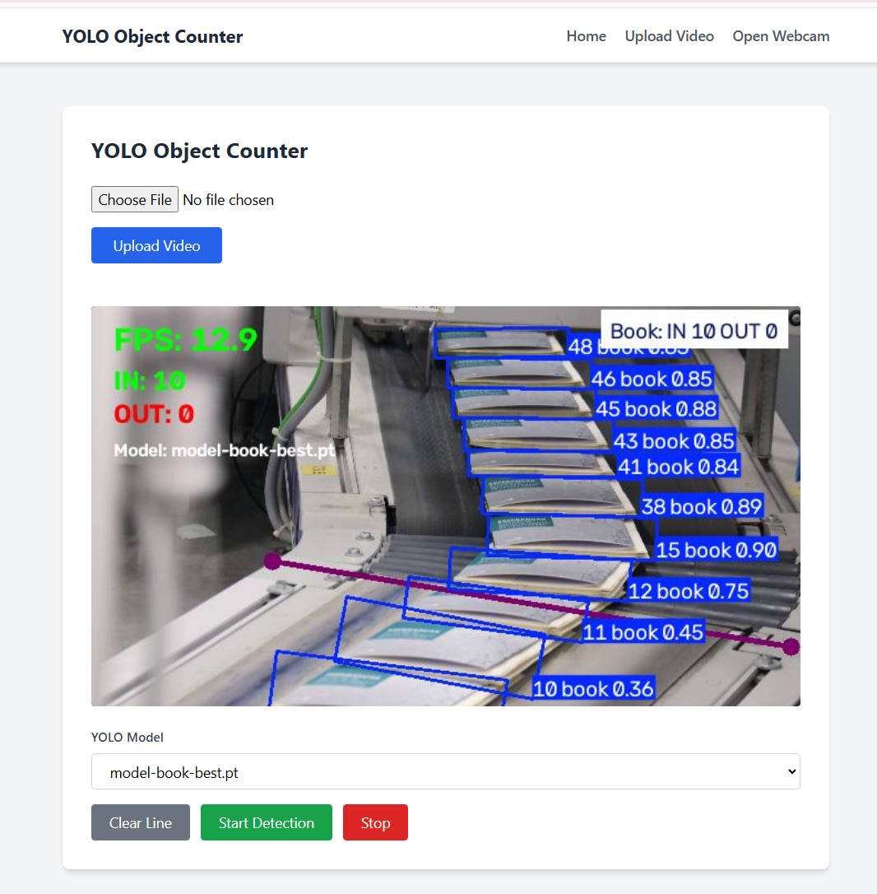
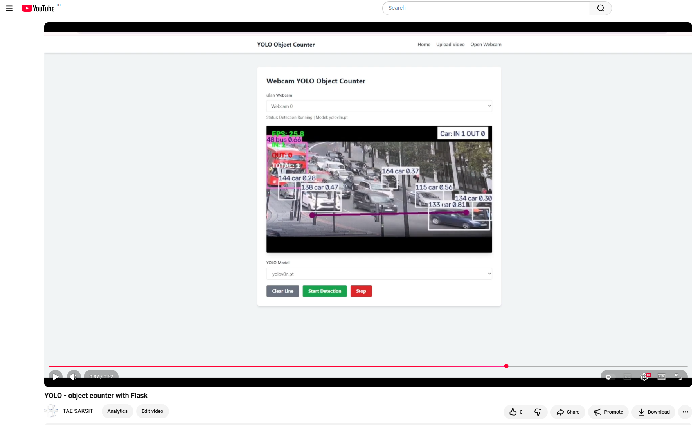

# YOLO Object Counter With Flask

A simple Flask web application for YOLO object counter with video files and webcam.


▶️ Video Demo : https://youtu.be/IryjkMwz_aI


---
## Features
- Upload and process video
- Draw a custom counting line
- Select YOLO model
- Real-time webcam detection
- CPU / GPU support


## Example


<div>
<table>
    <tr>
        <td></td>
        <td>
            <a href="https://youtu.be/IryjkMwz_aI"></a>
        </td>
    </tr>
</table>
</div>


## Folder Structure

```text
📦 Flask Video & Camera With YOLO
├── 📂 controllers/
│   ├── 📄 upload_controller.py
│   └── 📄 webcam_controller.py
│
├── 📂 services/
│   └── 📄 model_service.py
│
├── 📂 utils/
│   ├── 📄 device.py
│   └── 📄 monad.py
│
├── 📂 models/
│   └── 📄 *.pt
│
├── 📂 static/
│   └── 📂 uploads/
│
├── 📂 templates/
│   ├── 📄 layout.html
│   ├── 📄 index.html
│   ├── 📄 upload.html
│   └── 📄 webcam.html
│
├── 📄 app.py
├── 📄 requirements.txt
└── 📄 README.md
```
